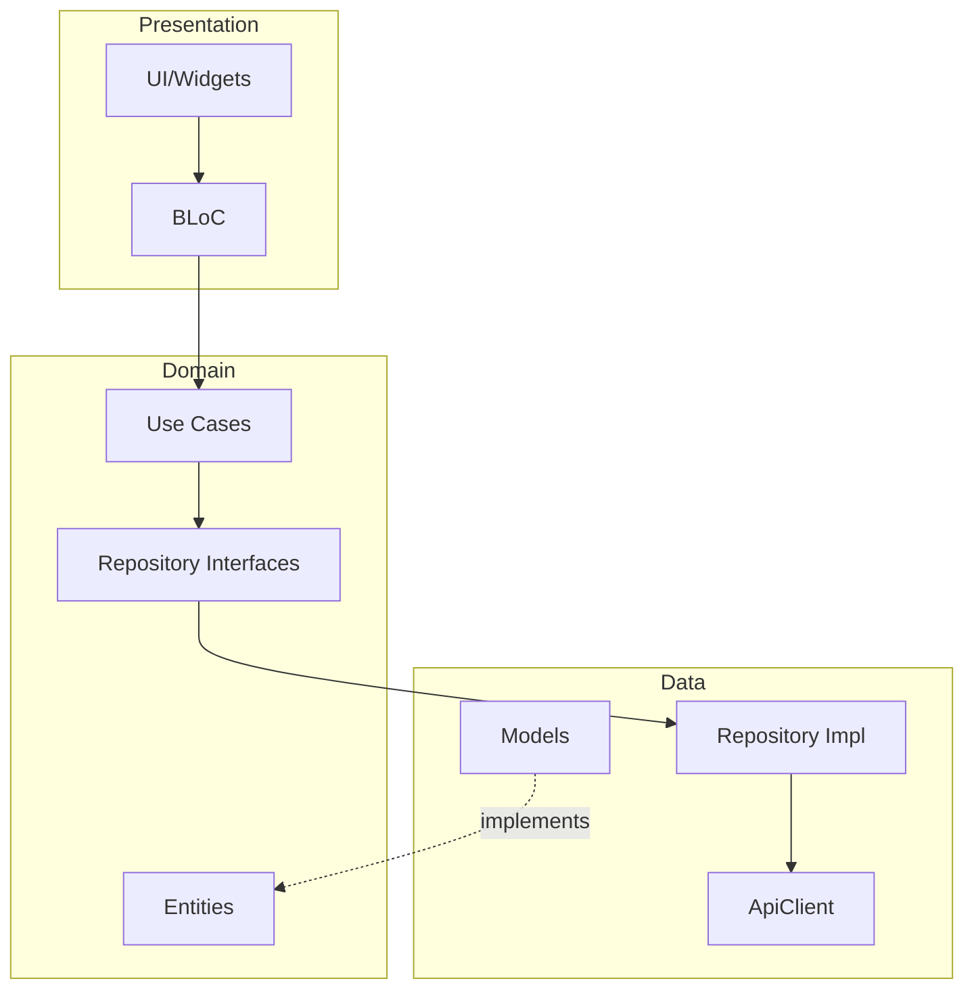

# Architecture Overview

${{ values.appName }} is built on **Clean Architecture** principles.

## Clean Architecture Layers

## Layer Responsibilities

### 🎨 Presentation Layer
- **Location**: `lib/features/*/presentation/`
- **Contains**: Pages, Widgets, BLoC
- **Responsibility**: UI and user interactions

### 🎯 Domain Layer
- **Location**: `lib/features/*/domain/`
- **Contains**: Entities, Use Cases, Repository Interfaces
- **Responsibility**: Business logic (pure Dart)

### 📦 Data Layer
- **Location**: `lib/features/*/data/`
- **Contains**: Models, Repository Implementations, ApiClient
- **Responsibility**: Data operations and external communications

Repositories directly use `ApiClient` for network calls, keeping the architecture simple and pragmatic.

## Benefits

✅ **Testability** - Each layer tested independently  
✅ **Maintainability** - Clear separation of concerns  
✅ **Scalability** - Easy to add features  
✅ **Flexibility** - Easy to swap implementations  
✅ **Simplicity** - No unnecessary abstraction layers

## Learn More

- [Project Structure](project-structure.md)
- [Adding a Feature](../guides/adding-feature.md)
